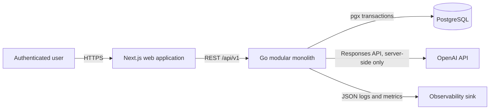
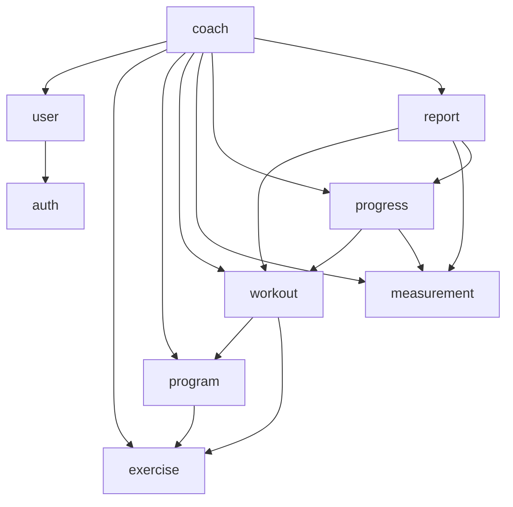

# GymTracker AI architecture

Status: proposed design baseline

Last updated: 2026-08-02

## 1. Architectural drivers

The architecture prioritizes reliable workout history, strict per-user isolation, explicit control over AI actions, and a small operational footprint. The first release is one product maintained as one modular Go backend, one Next.js frontend, and one PostgreSQL database. OpenAI is an optional external dependency for coach responses and narrative report insight; core tracking remains available without it.

The fixed technology choices are listed in the root `README.md`. This document defines how they fit together and which boundaries implementation must preserve.

## 2. System context



- The browser communicates only with the GymTracker backend. It never calls OpenAI.
- PostgreSQL is the source of truth for user data, job state, reports, and AI recommendation decisions.
- The backend is stateless with respect to HTTP sessions except for persisted refresh-session metadata and durable asynchronous states in PostgreSQL.
- In production, frontend and API should be presented through one trusted HTTPS site/reverse proxy. Development can use separate ports with an exact CORS allowlist.

## 3. Deployment shape

The implemented Compose topology is:

- `frontend`: Next.js application;
- `backend`: Go application that will contain all nine business modules and a lightweight internal pending-work runner;
- `postgres`: PostgreSQL with a persistent named volume;
- `migrate`: one-shot deployment task that applies numbered `golang-migrate` files once before backend startup;
- `db-seed`: opt-in `tools` profile task for the reviewed system exercise catalogue.

`migrate` and `db-seed` are lifecycle tasks built from the same backend repository, not long-running services or module boundaries. API replicas never run migrations themselves, which prevents concurrent startup migration races.

This remains a modular monolith. The pending-work runner is part of the same codebase/process and calls the same application services; it is not a separate service boundary. Multiple `api` replicas may be introduced later only if PostgreSQL row locking/advisory locking prevents duplicate work.

No broker, cache, object store, search service, analytics database, or service mesh is justified for the initial requirements. Add one only after a measured bottleneck and documented decision.

## 4. Backend internal architecture

### 4.1 Layers inside each module

Each module may contain only the layers it needs:

- **HTTP transport:** chi routes, authentication/authorization middleware integration, JSON decoding, request validation, response/problem mapping, and OpenAPI conformance.
- **Application:** use-case orchestration, transaction boundaries, idempotency, module public ports, and authorization-aware commands/queries.
- **Domain:** state transitions, value validation, calculations, and domain errors without HTTP or database dependencies.
- **Persistence/infrastructure:** explicit pgx queries, row mapping, OpenAI adapter, and external-system error translation.

Do not introduce generic repositories, a dependency-injection framework, a global domain event framework, or interfaces with only one non-test use unless a concrete boundary requires them. Constructors and explicit wiring in the composition root are sufficient.

### 4.2 Module dependency map



An arrow means “uses a small public application/query port,” not permission to import persistence internals or write another module's tables. Authentication context and shared technical primitives are supplied by the platform layer rather than modeled as business-module arrows.

### 4.3 Module responsibilities

| Module | Owns | Public capabilities | Must not do |
|---|---|---|---|
| `auth` | Authentication identity, password hashes, JWT issuance/verification, refresh sessions | Register/login, rotate/revoke sessions, authenticate request | Own profile preferences or expose token material |
| `user` | User profile and preferences | Read/update authenticated profile; account-deletion orchestration | Verify passwords or query training tables directly |
| `exercise` | Global and user-owned exercise catalogue | Search visible exercises; manage custom exercises; verify visibility | Modify program/workout snapshots |
| `program` | Programs, ordered days, exercise prescriptions, versions/lifecycle | CRUD and ordering; activate/archive; apply validated commands | Rewrite completed workouts or accept model calls directly |
| `workout` | Workout aggregate, exercise snapshots, performed sets, lifecycle | Plan/start/edit/complete/cancel/reopen; history queries | Derive arbitrary analytics in HTTP handlers |
| `measurement` | Body measurements and daily wellness | CRUD and bounded history queries | Generate coach text or weekly reports |
| `progress` | Personal records and deterministic progress calculations | Recalculate records; return bounded aggregate series | Accept manual record writes or call OpenAI |
| `report` | Versioned weekly report snapshots and generation state | Request/generate/retry/read reports; optionally generate narrative from stored metrics | Treat AI narrative as source metrics or import coach internals |
| `coach` | Conversations, messages, typed recommendations, coach OpenAI orchestration/tool registry | Send/process messages; safe tools; confirm/reject recommendations | Read arbitrary tables or mutate a program before confirmation |

### 4.4 Cross-module workflows

Cross-module workflows use an application coordinator and one shared pgx transaction where atomicity is required:

- **Registration:** `auth` creates the identity and `user` creates the default profile atomically.
- **Start from program:** `workout` asks `program` for an authorized prescription snapshot and `exercise` for visible metadata, then owns the copied workout rows.
- **Complete/reopen workout:** `workout` validates and changes status; `progress` recalculates affected personal records. Any completion/correction affecting an already generated period marks its current report stale. The coordinator commits all changes together.
- **Source measurement/wellness mutation:** `measurement` changes the owned row and marks every current report covering the event/day before or after the mutation stale in the same transaction.
- **Generate report:** `report` captures one `REPEATABLE READ` snapshot/cutoff, gets bounded deterministic aggregates through `workout`, `measurement`, and `progress` query ports, and commits an immutable metric snapshot. It then optionally sends only a specialized safe backend-context projection of those stored metrics to its narrative-generator port. When the second OpenAI use is implemented, only redacted HTTP/auth transport is shared under `platform/openai`; report prompting remains in `report`, so `report` and `coach` do not depend on one another.
- **Confirm recommendation:** `coach` locks and validates the recommendation; `program` validates and applies the typed command against the base version; `coach` marks it applied in the same transaction.

In-process notifications are allowed after commit for non-critical wakeups, but correctness cannot depend on an in-memory event surviving a crash. Durable `pending`/`stale` rows in PostgreSQL are the recovery mechanism.

## 5. Key domain aggregates

- **Program aggregate:** `programs` root with `program_days` and `program_day_exercises`. Any nested mutation increments `programs.version` and changes its ETag.
- **Workout aggregate:** `workouts` root with `workout_exercises` and `workout_sets`. Any nested mutation increments `workouts.version`. Completed snapshots are immutable until an explicit reopen transition.
- **Coach recommendation aggregate:** recommendation root plus immutable structured proposal, decision metadata, target/base version, and apply result.
- **Weekly report aggregate:** an immutable revision for one user/week with deterministic metrics, input cutoff, optional AI insight, and generation state.

Database constraints enforce local invariants; application services enforce cross-row and cross-module transitions. Full details are in `database-schema.md`.

The first release permits at most one `in_progress` workout per user. The database partial unique index is authoritative; start/reopen translates its conflict into `409 workout_already_in_progress` rather than cancelling or merging sessions.

## 6. Time, units, and numeric rules

- PostgreSQL uses `timestamptz` for every instant. Connections execute with time zone `UTC`; API/log output is RFC 3339 UTC with `Z`.
- No `timestamp without time zone` is permitted. User-visible local days/weeks are calculated with the profile's validated IANA zone and stored as exact UTC start/end instants plus a zone snapshot.
- Time intervals are half-open: `from` is inclusive and `to` is exclusive.
- Weights and lengths are persisted in kilograms and centimetres. Frontend forms convert preferred units to canonical values before submission and responses identify canonical units.
- Database `numeric` values are serialized as JSON numbers where precision is safe for documented ranges; calculations use explicit rounding policies.
- RIR is optional for performed sets and constrained to one decimal place from `0.0` to `10.0`.

## 7. Authentication and request context

- Access JWT lifetime target: 15 minutes. It is returned in login/refresh JSON, held in browser memory, and sent as `Authorization: Bearer`.
- Refresh JWT lifetime target: 30 days. It is stored only in a `Secure`, `HttpOnly`, `SameSite=Lax` cookie scoped to auth endpoints, rotated on every use, and represented in PostgreSQL only by a cryptographic hash and session/family metadata.
- Both token types have distinct purpose/audience claims. Access claims contain `sub`, session/family ID, `jti`, issuer, audience, issued-at, and expiry, but no email, profile, or training data.
- Request middleware verifies signature, purpose, issuer, audience, expiry, and user status, then creates an immutable server request context with authenticated user ID, session ID, request ID, and deadline.
- Application services derive ownership from that context. Payload/path IDs select a resource but never establish its owner.

The browser does not persist access tokens in local storage. After a page reload it obtains a new access token through the protected refresh endpoint. Private screens can render a stable shell and load user data through TanStack Query after session bootstrap; a Next.js BFF is not introduced merely to hide the established Go REST API.

## 8. REST API architecture

- All endpoints live under `/api/v1` and are defined in `api-contract.md` and the future OpenAPI document.
- JSON uses `snake_case`, UUID identifiers, and explicit UTC timestamps.
- Successful responses use a consistent `{ "data": ..., "meta": ... }` envelope; errors use `application/problem+json` compatible with RFC 9457.
- Cursor pagination is used for growing collections. Chart and tool queries are aggregated and range-bounded.
- High-risk/retry-prone POST operations require `Idempotency-Key` and are persisted without storing authentication responses or secrets.
- Program, workout, profile/AI settings, custom-exercise, body-measurement, wellness, conversation, recommendation, and report mutations use ETags/`If-Match` where lost updates matter.
- Unknown JSON fields and multiple JSON values are rejected; body size and request deadlines are route-specific.
- OpenAPI is design-first and committed. CI validates it, generated or typed clients as applicable, transport behavior, examples, and breaking changes.

## 9. Frontend architecture

### 9.1 App Router responsibilities

The proposed application is organized by route groups and product features rather than backend layers:

- public/auth routes for registration and login;
- authenticated app shell for dashboard, programs, active workout, history, measurements, progress, weekly reports, profile, and coach;
- feature-local components, Zod schemas, forms, query keys, and API adapters;
- shared accessible UI primitives based on shadcn/ui-compatible components and Tailwind design tokens.

Server Components provide layout and non-secret static content. Interactive/private state, forms, optimistic updates, workout logging, and charts are Client Components only where needed. There is no duplicate business-rule implementation: Zod improves UX at the boundary, while the Go backend remains authoritative.

### 9.2 Data and form behavior

- TanStack Query owns server cache, invalidation, retries, pending work polling, and cursor pages. Query keys include authenticated scope and filter objects.
- React Hook Form owns form state; Zod schemas enforce documented client constraints and convert display units to canonical values.
- Mutations generate idempotency keys for contract-required operations and retain them across transport retries.
- ETags returned by aggregate queries are retained and sent in `If-Match`; `412` produces a visible refresh/conflict flow rather than an overwrite.
- Recharts receives bounded aggregate series from progress endpoints. Accessible textual summaries/tables accompany charts.
- The program recommendation screen renders a field-level before/after diff, rationale, base version, expiry, and separate confirm/reject controls.

## 10. Asynchronous work without microservices

Coach messages and weekly reports can exceed a normal interactive request deadline. Their create endpoints persist `pending` state and return `202`. A lightweight runner inside the Go monolith:

1. selects eligible rows with `FOR UPDATE SKIP LOCKED`;
2. records a fresh processing-attempt UUID/fencing token, lease expiry, attempt metadata, and moves them to `processing`/`generating`;
3. performs bounded computation/OpenAI calls outside long database transactions;
4. stores completed or failed results only when the row still has the same attempt token; a reclaimed/disabled/archived job makes a late worker's write fail;
5. resumes pending/stuck work after restart using leases/attempt timestamps.

The frontend polls resource status with bounded backoff. Server-Sent Events may be added later for UX, but correctness and the first API version do not require them. No WebSocket, broker, or standalone worker service is planned.

The original JWT is not retained for asynchronous work. At admission the owner is written only from verified request context. Before each provider/tool call, the runner reconstructs an execution principal from that trusted tenant-safe row and rechecks active user, enabled AI setting/notice, active conversation, and current fencing token. Archiving a conversation, disabling AI, or deleting/disabling the account invalidates leases/cancels pending work; no further tools/provider calls or late result writes are allowed.

## 11. OpenAI integration boundary

The `coach` infrastructure adapter uses the OpenAI Responses API from the backend with a server-configured model. GymTracker explicitly sends `store: false` on every initial, continuation, and retry request; omission is an adapter error covered by an outbound contract test. Conversation history remains under application control. Direct context is limited to the current submitted coach text and bounded same-conversation history; profile and all training/body/wellness/progress/report facts arrive only through selected backend tools. A shared `platform/openai` package is limited to concrete provider HTTP/auth/redaction behavior only after both coach and report insight need it; it contains no business prompts or tool policy.

Function tools use strict JSON Schema (`strict: true`, required nullable fields where needed, and `additionalProperties: false`). Initial orchestration disables parallel tool calls for deterministic sequencing and auditability. Each continuation transiently appends every prior `response.output` item required by the API—including function-call and opaque/encrypted reasoning items—then the matching function output. These provider items are never logged, returned, or retained long-term. Tool handlers:

- receive authenticated user identity from server context, never model arguments;
- call module query ports only, or the pure run-local proposal validator, with field, row, date-range, and timeout limits;
- return minimal structured facts with provenance timestamps;
- never expose secrets, auth identity internals, unrestricted free-text notes, or another user's data;
- cannot mutate core data; `propose_program_change` returns a validated canonical candidate, which is persisted as a `proposed` recommendation only when the assistant response completes successfully.

The system prompt is useful guidance but is not a security boundary. Backend authorization, schema/domain validation, tool allowlists, transaction state machines, and explicit confirmation are the security controls. See `ai-coach.md` and `security.md`.

Relevant official references:

- [OpenAI function calling](https://developers.openai.com/api/docs/guides/function-calling)
- [OpenAI conversation state](https://developers.openai.com/api/docs/guides/conversation-state)
- [OpenAI data controls](https://developers.openai.com/api/docs/guides/your-data)
- [OpenAI safety best practices](https://developers.openai.com/api/docs/guides/safety-best-practices)

## 12. Persistence and transactions

- pgx pools are configured with bounded connections, acquisition/statement/transaction deadlines, health checks, and UTC sessions.
- SQL is explicit and parameterized. A query generator may be proposed later only if it supports Go 1.22.2 and demonstrably reduces risk without hiding SQL ownership.
- `golang-migrate` owns forward and down migration files once implementation begins. Migrations are reviewed for locking/backfill behavior and run separately before application startup in production.
- Database checks, foreign keys, unique/partial indexes, and optimistic versions enforce documented invariants.
- Transaction isolation defaults to `READ COMMITTED` with row locks for aggregate mutations. Activation, token rotation, recommendation confirmation, report revisioning, and record recalculation lock the relevant rows; use stronger isolation only for a demonstrated anomaly.
- No distributed transaction is needed. OpenAI calls are never made while holding a database transaction open.

## 13. Reliability and degradation

- OpenAI failure does not block auth, programs, workouts, measurements, progress, or deterministic report metrics.
- Coach/report failures store a safe error code and retry metadata; raw provider errors are not shown to users or logged with prompt data.
- HTTP handlers use deadlines and propagate cancellation to pgx/OpenAI.
- State-changing operations are transactional and safe to retry through idempotency records or state/version checks.
- Graceful shutdown stops accepting requests, completes bounded in-flight work, releases work leases, and closes the pgx pool.
- Database backups, restore tests, retention, and encryption are deployment requirements described in `security.md`.

## 14. Observability

Structured JSON logs include `timestamp`, `level`, `service`, `environment`, `request_id`, route template, method, status, duration, and stable safe error code. User IDs may be represented by a keyed pseudonymous log identifier where correlation is needed. Logs never contain credentials, authorization/cookie headers, raw AI prompts, unrestricted message bodies, or full tool payloads.

Metrics should cover request latency/error rates, pgx pool pressure/query duration, authentication failures/refresh reuse, pending-work depth/age/retries, report generation, OpenAI latency/status/token usage/cost dimensions, and recommendation outcomes. Traces may be added later with the same redaction policy.

## 15. Architecture decisions and trade-offs

| Decision | Selected approach | Trade-off |
|---|---|---|
| Service topology | Modular monolith | Simpler transactions/deployment; module discipline is enforced in code review rather than network boundaries |
| Active program edits | Allow versioned edits, including confirmed AI diffs | Better UX and no revision aggregate; relies on workout snapshots and recommendation audit rather than immutable program versions |
| Tenant isolation | Mandatory application ownership predicates and tests; no initial PostgreSQL RLS | Less pgx/session complexity; weaker defense-in-depth, so RLS must be reconsidered before higher-assurance multi-tenancy |
| Async processing | Durable statuses plus internal runner | No broker/worker operations; API process must manage leases and backpressure carefully |
| Access token storage | Browser memory; refresh token HttpOnly cookie | Reduces token theft persistence/CSRF surface; reload needs refresh bootstrap and private SSR is limited |
| Canonical units | kg/cm in DB and API | Simple analytics; clients must correctly convert and label imperial input/output |
| AI context | `store: false`, app-managed bounded context | Better data minimization/control; more token/context engineering and no reliance on provider conversation persistence |
| AI tool sequencing | Disable parallel calls initially | Easier auditing/rate control; potentially higher coach latency |
| Analytics | Query-time aggregates plus persisted PR/report snapshots | Avoids warehouse complexity; indexes and bounded ranges are essential as history grows |

Any future reversal requires documented evidence and migration/API/security impact.

## 16. Proposed repository layout (not yet created)

```text
GymTrackerAI/
  AGENTS.md
  README.md
  docs/
  backend/
    cmd/api/
    internal/{auth,user,exercise,program,workout,measurement,progress,report,coach}/
    internal/platform/{config,database,httpserver,logging}/
    migrations/
    openapi/
  frontend/
    app/
    features/
    components/ui/
    lib/
  compose.yaml
  Makefile
  .env.example
  .github/workflows/
```

This is a future implementation layout, not authorization to create empty scaffolding. Folders are introduced only with working, tested functionality.
