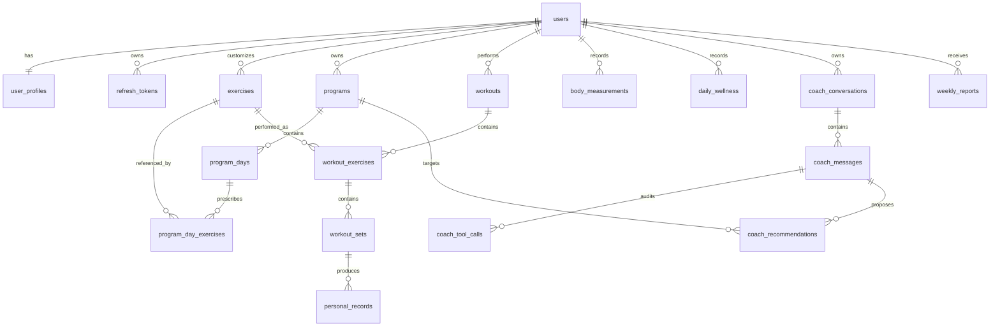

# GymTracker AI PostgreSQL schema

Status: logical schema baseline; no migrations have been created

Last updated: 2026-08-02

## 1. Conventions

- PostgreSQL is the system of record. Tables use plural `snake_case` names in the `public` schema.
- Primary keys are backend-generated UUIDs. The design does not require a PostgreSQL UUID extension.
- Every instant is `timestamptz`; `timestamp without time zone` and server-local timestamps are forbidden. PostgreSQL, pgx sessions, application logs, and containers run in UTC.
- API timestamps use RFC 3339 with `Z`. Local calendar boundaries are calculated with a validated IANA zone, then stored as exact UTC instants plus the zone name used for calculation.
- Status/type columns are `text` with `CHECK`, not PostgreSQL enums, so additions remain ordinary migrations.
- Weights are `numeric` kilograms and lengths are `numeric` centimetres. Preferred display units do not affect persistence.
- RIR is `numeric(3,1)` constrained to `0.0..10.0`.
- Mutable rows have `created_at` and `updated_at`; backend code sets `updated_at` explicitly. Immutable audit rows have `created_at`/`occurred_at` only.
- Every foreign-key column has a supporting index unless it is already the leading part of a unique/primary index.
- JSONB is limited to versioned document snapshots: typed coach proposals, minimized tool audit summaries, report metrics, and idempotent response replay. Core training data remains relational.

Example defaults below describe intent, not a migration. Exact constraint/index names will be explicit in future migration files.

## 2. Tenant isolation pattern

Private aggregate roots contain `user_id` and `UNIQUE (id, user_id)`. Private child tables intentionally repeat `user_id` and use composite foreign keys such as:

```text
(program_id, user_id) -> programs(id, user_id)
```

This controlled redundancy prevents a child row from connecting aggregates owned by different users. Every persistence query must still derive the actor from verified request context and include `user_id`; querying a private resource by `id` alone is forbidden.

`exercises` is the one conditional-ownership table: global rows have `owner_user_id IS NULL`; custom rows have an owner. The backend allows a reference only when `owner_user_id IS NULL OR owner_user_id = actor_user_id` in the same transaction.

PostgreSQL row-level security is not part of the first implementation. It is a possible defense-in-depth layer, but safe pooled-session use adds complexity and does not replace explicit user scoping. Cross-user query and backend-tool integration tests are mandatory.

## 3. Relationship overview



## 4. Authentication and user tables

### 4.1 `users` (`auth` module)

| Column | Type | Null | Rules |
|---|---|---:|---|
| `id` | `uuid` | no | PK |
| `email` | `text` | no | normalized lowercase/trimmed; unique; `email = lower(btrim(email))` |
| `password_hash` | `text` | no | versioned Argon2id encoded hash; never returned |
| `status` | `text` | no | default `active`; `active`, `disabled`, `deleted` |
| `auth_version` | `integer` | no | default 1, `> 0`; increment to invalidate outstanding JWTs |
| `email_verified_at` | `timestamptz` | yes | reserved for verification policy |
| `disabled_at` | `timestamptz` | yes | required when disabled |
| `deleted_at` | `timestamptz` | yes | soft-delete instant before purge |
| `created_at` | `timestamptz` | no | UTC |
| `updated_at` | `timestamptz` | no | UTC |

Indexes: unique `email`; `status` for administrative/purge work. Status/timestamp checks keep `disabled_at` and `deleted_at` consistent. Reusing a soft-deleted email is not initially allowed.

### 4.2 `user_profiles` (`user` module)

| Column | Type | Null | Rules |
|---|---|---:|---|
| `user_id` | `uuid` | no | PK, FK `users(id) ON DELETE CASCADE` |
| `display_name` | `text` | yes | trimmed, max length defined by API |
| `timezone` | `text` | no | default `UTC`; backend validates IANA identifier |
| `locale` | `text` | no | default `ru-RU`; supported allowlist |
| `preferred_unit_system` | `text` | no | `metric`, `imperial` |
| `height_cm` | `numeric(6,2)` | yes | `> 0` and within API human range |
| `experience_level` | `text` | yes | `beginner`, `intermediate`, `advanced` |
| `training_goal` | `text` | yes | bounded user-authored summary |
| `ai_coach_enabled` | `boolean` | no | default false; gates provider/tool processing |
| `ai_notice_version` | `text` | yes | required while enabled; reviewed notice identifier |
| `ai_enabled_at` | `timestamptz` | yes | required while enabled |
| `ai_disabled_at` | `timestamptz` | yes | latest disable instant |
| `version` | `bigint` | no | default 1, `> 0`; ETag/lost-update protection |
| `created_at` | `timestamptz` | no | UTC |
| `updated_at` | `timestamptz` | no | UTC |

Registration creates `users` and `user_profiles` in one transaction.

### 4.3 `refresh_tokens` (`auth` module)

Only a SHA-256 hash of the complete refresh JWT is stored, never the token itself.

| Column | Type | Null | Rules |
|---|---|---:|---|
| `id` | `uuid` | no | PK for one rotated token row; `family_id` is the stable session identifier |
| `user_id` | `uuid` | no | FK `users(id) ON DELETE CASCADE` |
| `jti` | `uuid` | no | unique JWT ID |
| `family_id` | `uuid` | no | refresh-rotation family |
| `token_hash` | `bytea` | no | unique, exactly 32 bytes |
| `expires_at` | `timestamptz` | no | `expires_at > created_at` |
| `last_used_at` | `timestamptz` | yes | latest successful use |
| `revoked_at` | `timestamptz` | yes | revocation/reuse instant |
| `replaced_by_token_id` | `uuid` | yes | unique same-owner/family self-FK, `ON DELETE NO ACTION` |
| `revocation_reason` | `text` | yes | safe stable reason code |
| `created_ip` | `inet` | yes | retention/redaction policy applies |
| `user_agent` | `text` | yes | bounded and treated as untrusted |
| `created_at` | `timestamptz` | no | UTC |
| `updated_at` | `timestamptz` | no | UTC lifecycle update |

Constraints/indexes: `UNIQUE (id, user_id, family_id)`; the replacement relation is `(replaced_by_token_id, user_id, family_id) -> refresh_tokens(id, user_id, family_id) ON DELETE NO ACTION`, guaranteeing the same owner/family; active `(user_id, expires_at) WHERE revoked_at IS NULL`; `(user_id, family_id, created_at DESC)`; unique `jti`, `token_hash`, and non-null `replaced_by_token_id`. Reuse of a rotated token revokes its entire family and increments `auth_version` when policy requires global invalidation.

## 5. Exercise and program tables

### 5.1 `exercises` (`exercise` module)

| Column | Type | Null | Rules |
|---|---|---:|---|
| `id` | `uuid` | no | PK |
| `owner_user_id` | `uuid` | yes | FK `users(id) ON DELETE CASCADE`; null means global/system |
| `name` | `text` | no | non-empty |
| `description` | `text` | yes | bounded free text |
| `instructions` | `text` | yes | bounded free text; excluded from AI tools by default |
| `primary_muscle_group` | `text` | yes | filterable controlled value |
| `equipment` | `text` | yes | filterable controlled value |
| `movement_pattern` | `text` | yes | filterable controlled value |
| `is_unilateral` | `boolean` | no | default false |
| `version` | `bigint` | no | default 1, `> 0` |
| `archived_at` | `timestamptz` | yes | custom exercise archive; global managed operationally |
| `created_at` | `timestamptz` | no | UTC |
| `updated_at` | `timestamptz` | no | UTC |

Partial expression indexes enforce case-insensitive uniqueness separately:

- `UNIQUE (lower(name)) WHERE owner_user_id IS NULL`;
- `UNIQUE (owner_user_id, lower(name)) WHERE owner_user_id IS NOT NULL AND archived_at IS NULL`.

Additional indexes: `(owner_user_id, archived_at)`, searchable normalized name. Program/workout FKs use `ON DELETE NO ACTION`; referenced exercises are archived, not hard-deleted during normal use.

### 5.2 `programs` (`program` module)

| Column | Type | Null | Rules |
|---|---|---:|---|
| `id` | `uuid` | no | PK |
| `user_id` | `uuid` | no | FK `users(id) ON DELETE CASCADE` |
| `name` | `text` | no | non-empty |
| `description` | `text` | yes | bounded |
| `goal` | `text` | yes | bounded |
| `status` | `text` | no | `draft`, `active`, `inactive`, `archived` |
| `version` | `bigint` | no | default 1, `> 0`; increments for every tree mutation |
| `activated_at` | `timestamptz` | yes | latest activation |
| `inactivated_at` | `timestamptz` | yes | latest replacement/deactivation |
| `archived_at` | `timestamptz` | yes | required for archived |
| `created_at` | `timestamptz` | no | UTC |
| `updated_at` | `timestamptz` | no | UTC |

Constraints/indexes: `UNIQUE (id, user_id)` for tenant FKs; `UNIQUE (user_id) WHERE status = 'active'`; `(user_id, status, updated_at DESC)`. Activation locks the existing active program and target, explicitly moves the old one to `inactive`, and activates the target atomically.

### 5.3 `program_days` (`program` module)

| Column | Type | Null | Rules |
|---|---|---:|---|
| `id` | `uuid` | no | PK |
| `user_id` | `uuid` | no | tenant component |
| `program_id` | `uuid` | no | composite FK with user to `programs`, cascade on purge |
| `position` | `smallint` | no | `> 0` |
| `name` | `text` | no | non-empty |
| `notes` | `text` | yes | bounded |
| `archived_at` | `timestamptz` | yes | normal DELETE semantics if referenced |
| `created_at` | `timestamptz` | no | UTC |
| `updated_at` | `timestamptz` | no | UTC |

Constraints/indexes: `UNIQUE (id, user_id)`; partial `UNIQUE (program_id, position) WHERE archived_at IS NULL`; `(program_id, user_id)`; `(user_id, program_id)`. Position changes are transactionally reordered without temporary uniqueness collisions.

### 5.4 `program_day_exercises` (`program` module)

| Column | Type | Null | Rules |
|---|---|---:|---|
| `id` | `uuid` | no | PK |
| `user_id` | `uuid` | no | tenant component |
| `program_day_id` | `uuid` | no | composite FK with user to `program_days`, cascade on purge |
| `exercise_id` | `uuid` | no | FK `exercises(id) ON DELETE NO ACTION`; visibility checked on write |
| `position` | `smallint` | no | `> 0` |
| `target_sets` | `smallint` | no | `1..100` |
| `target_reps_min` | `smallint` | yes | `>= 0` |
| `target_reps_max` | `smallint` | yes | `>= target_reps_min` when both exist |
| `target_rir` | `numeric(3,1)` | yes | `0..10` |
| `rest_seconds` | `integer` | yes | `0..86400` |
| `notes` | `text` | yes | bounded |
| `archived_at` | `timestamptz` | yes | preserves provenance |
| `created_at` | `timestamptz` | no | UTC |
| `updated_at` | `timestamptz` | no | UTC |

Constraints/indexes: `UNIQUE (id, user_id)`; partial `UNIQUE (program_day_id, position) WHERE archived_at IS NULL`; `(program_day_id, user_id)`; `(exercise_id)`; `(user_id, exercise_id)`; `(program_day_id, archived_at)`. The same exercise may intentionally appear multiple times on a day at different positions over archived revisions, but only one active item occupies a position.

## 6. Workout tables

### 6.1 `workouts` (`workout` module)

| Column | Type | Null | Rules |
|---|---|---:|---|
| `id` | `uuid` | no | PK |
| `user_id` | `uuid` | no | FK `users(id) ON DELETE CASCADE` |
| `source_program_day_id` | `uuid` | yes | composite FK with user to archived-or-active `program_days`, `NO ACTION` |
| `source_program_version` | `bigint` | yes | copied program version at instantiation |
| `name` | `text` | no | workout/program-day name snapshot |
| `status` | `text` | no | `planned`, `in_progress`, `completed`, `cancelled` |
| `scheduled_at` | `timestamptz` | yes | optional plan instant |
| `started_at` | `timestamptz` | yes | required for in-progress/completed |
| `completed_at` | `timestamptz` | yes | required only for completed; not before start |
| `cancelled_at` | `timestamptz` | yes | required only for cancelled |
| `notes` | `text` | yes | bounded |
| `version` | `bigint` | no | default 1, `> 0`; aggregate ETag |
| `created_at` | `timestamptz` | no | UTC |
| `updated_at` | `timestamptz` | no | UTC |

Constraints/indexes: `UNIQUE (id, user_id)`; status/timestamp consistency checks; partial `UNIQUE (user_id) WHERE status = 'in_progress'`; `(user_id, started_at DESC, id DESC)`; `(user_id, status, scheduled_at)`; `(source_program_day_id, user_id)`. A second start returns `409 workout_already_in_progress`.

### 6.2 `workout_exercises` (`workout` module)

| Column | Type | Null | Rules |
|---|---|---:|---|
| `id` | `uuid` | no | PK |
| `user_id` | `uuid` | no | tenant component |
| `workout_id` | `uuid` | no | composite FK with user to `workouts`, cascade on purge |
| `exercise_id` | `uuid` | no | FK `exercises(id) ON DELETE NO ACTION` |
| `source_program_day_exercise_id` | `uuid` | yes | composite FK with user, `NO ACTION` |
| `position` | `smallint` | no | `> 0` |
| `exercise_name_snapshot` | `text` | no | immutable historical name |
| `notes` | `text` | yes | bounded |
| `created_at` | `timestamptz` | no | UTC |
| `updated_at` | `timestamptz` | no | UTC |

Constraints/indexes: `UNIQUE (id, user_id)`; `UNIQUE (workout_id, position)`; `(workout_id, user_id)`; `(exercise_id)`; `(source_program_day_exercise_id, user_id)`; `(user_id, exercise_id)`; `(workout_id, position)`.

### 6.3 `workout_sets` (`workout` module)

| Column | Type | Null | Rules |
|---|---|---:|---|
| `id` | `uuid` | no | PK |
| `user_id` | `uuid` | no | tenant component |
| `workout_exercise_id` | `uuid` | no | composite FK with user to `workout_exercises`, cascade on purge |
| `position` | `smallint` | no | `> 0`, unique per workout exercise |
| `set_type` | `text` | no | `warmup`, `working`, `backoff`, `drop`, `failure` |
| `status` | `text` | no | `planned`, `completed`, `skipped` |
| `target_weight_kg` | `numeric(8,3)` | yes | `>= 0`; copied prescription/previous-performance target |
| `target_reps_min` | `smallint` | yes | `>= 0` |
| `target_reps_max` | `smallint` | yes | max not below min |
| `target_rir` | `numeric(3,1)` | yes | `0..10` |
| `weight_kg` | `numeric(8,3)` | yes | actual, `>= 0`; required when completed |
| `reps` | `smallint` | yes | actual, `>= 0`; required when completed |
| `rir` | `numeric(3,1)` | yes | actual, `0..10` |
| `completed_at` | `timestamptz` | yes | required when completed |
| `notes` | `text` | yes | bounded |
| `created_at` | `timestamptz` | no | UTC |
| `updated_at` | `timestamptz` | no | UTC |

Constraints/indexes: `UNIQUE (id, user_id)`; `UNIQUE (workout_exercise_id, position)`; completed/planned/skipped consistency checks; `(user_id, completed_at DESC)`; `(workout_exercise_id, user_id)`; `(workout_exercise_id, position)`.

Planned target rows are copied into the workout. Subsequent program changes therefore cannot alter a workout already instantiated. Completed aggregates are immutable until an explicit reopen transition; reopen causes affected records/reports to be recalculated or marked stale.

## 7. Measurement and progress tables

### 7.1 `body_measurements` (`measurement` module)

One row is one measurement event. Multiple nullable atomic measurements in the event remain third-normal-form data and avoid an untyped EAV design.

| Column | Type | Null | Rules |
|---|---|---:|---|
| `id` | `uuid` | no | PK |
| `user_id` | `uuid` | no | FK `users(id) ON DELETE CASCADE` |
| `measured_at` | `timestamptz` | no | event instant |
| `weight_kg` | `numeric(8,3)` | yes | positive human range |
| `body_fat_percent` | `numeric(5,2)` | yes | `0..100` |
| `neck_cm` | `numeric(6,2)` | yes | positive human range |
| `chest_cm` | `numeric(6,2)` | yes | positive human range |
| `waist_cm` | `numeric(6,2)` | yes | positive human range |
| `hips_cm` | `numeric(6,2)` | yes | positive human range |
| `left_upper_arm_cm`, `right_upper_arm_cm` | `numeric(6,2)` | yes | positive human range |
| `left_thigh_cm`, `right_thigh_cm` | `numeric(6,2)` | yes | positive human range |
| `left_calf_cm`, `right_calf_cm` | `numeric(6,2)` | yes | positive human range |
| `notes` | `text` | yes | bounded |
| `source` | `text` | no | default `manual`; `manual`, `import` |
| `version` | `bigint` | no | default 1, `> 0`; item ETag |
| `created_at` | `timestamptz` | no | UTC |
| `updated_at` | `timestamptz` | no | UTC |

Checks require at least one numeric measurement and positive supported values. Constraints/indexes: `UNIQUE (id, user_id)`; `UNIQUE (user_id, measured_at)`; `(user_id, measured_at DESC, id DESC)`.

### 7.2 `daily_wellness` (`measurement` module)

| Column | Type | Null | Rules |
|---|---|---:|---|
| `id` | `uuid` | no | PK |
| `user_id` | `uuid` | no | FK `users(id) ON DELETE CASCADE` |
| `day_start_at` | `timestamptz` | no | backend-calculated start of local civil day converted to UTC |
| `timezone_at_entry` | `text` | no | current validated profile IANA zone snapshot; not client authority |
| `sleep_minutes` | `smallint` | yes | `0..1440` |
| `sleep_quality` | `smallint` | yes | `1..5` |
| `energy_level` | `smallint` | yes | `1..5` |
| `stress_level` | `smallint` | yes | `1..5` |
| `soreness_level` | `smallint` | yes | `1..5` |
| `mood` | `smallint` | yes | `1..5` |
| `resting_heart_rate` | `smallint` | yes | `20..250` |
| `notes` | `text` | yes | bounded |
| `version` | `bigint` | no | default 1, `> 0`; item ETag |
| `created_at` | `timestamptz` | no | UTC |
| `updated_at` | `timestamptz` | no | UTC |

Checks require at least one wellness value or non-empty notes and verify score ranges. The request supplies an observation instant; the backend calculates `day_start_at` from the current profile zone using civil-day rules (the first valid instant is not universally `00:00`). Constraints/indexes: `UNIQUE (id, user_id)`; `UNIQUE (user_id, day_start_at)`; `(user_id, day_start_at DESC)`.

### 7.3 `personal_records` (`progress` module)

This table is a rebuildable projection. Completed workout sets remain the source of truth.

| Column | Type | Null | Rules |
|---|---|---:|---|
| `id` | `uuid` | no | PK |
| `user_id` | `uuid` | no | FK `users(id) ON DELETE CASCADE` |
| `exercise_id` | `uuid` | no | FK `exercises(id) ON DELETE NO ACTION` |
| `workout_set_id` | `uuid` | no | composite FK with user to `workout_sets`, cascade with source |
| `record_type` | `text` | no | `max_weight`, `max_reps`, `estimated_1rm`, `max_set_volume` |
| `value` | `numeric(14,3)` | no | `>= 0`; unit implied by typed contract |
| `calculation_version` | `text` | no | version of PR discovery/comparison logic |
| `formula` | `text` | yes | required formula identifier for estimated 1RM |
| `achieved_at` | `timestamptz` | no | copied set completion instant |
| `created_at` | `timestamptz` | no | projection creation instant |

Constraints/indexes: `UNIQUE (id, user_id)`; `UNIQUE (user_id, workout_set_id, record_type)`; `(workout_set_id, user_id)`; `(exercise_id)`; `(user_id, exercise_id, record_type, value DESC)`; `(user_id, achieved_at DESC)`. There is no public write API. `exercise_id` is deliberate projection data; rebuild/integration tests prove it equals the source set's workout exercise. `max_reps` means the largest repetition count in one completed working set regardless of load.

## 8. Coach tables

### 8.1 `coach_conversations` (`coach` module)

| Column | Type | Null | Rules |
|---|---|---:|---|
| `id` | `uuid` | no | PK |
| `user_id` | `uuid` | no | FK `users(id) ON DELETE CASCADE` |
| `title` | `text` | yes | bounded |
| `status` | `text` | no | `active`, `archived` |
| `version` | `bigint` | no | default 1, `> 0`; item ETag |
| `created_at` | `timestamptz` | no | UTC |
| `updated_at` | `timestamptz` | no | last activity UTC |

Constraints/indexes: `UNIQUE (id, user_id)`; `(user_id, updated_at DESC, id DESC)`.

### 8.2 `coach_messages` (`coach` module)

| Column | Type | Null | Rules |
|---|---|---:|---|
| `id` | `uuid` | no | PK |
| `user_id` | `uuid` | no | tenant component |
| `conversation_id` | `uuid` | no | composite FK with user to conversation, cascade on purge |
| `sequence_number` | `bigint` | no | `> 0`, unique per conversation |
| `role` | `text` | no | `user`, `assistant`; system prompts are not persisted here |
| `status` | `text` | no | `pending`, `processing`, `completed`, `failed`, `cancelled` |
| `content` | `text` | yes | non-empty when user/completed assistant; null for pending placeholder |
| `client_message_id` | `uuid` | yes | client deduplication ID for user messages |
| `model` | `text` | yes | server-selected provider model ID/snapshot |
| `provider_response_id` | `text` | yes | opaque correlation ID; not used for ownership |
| `prompt_version` | `text` | yes | static policy/prompt version |
| `input_tokens`, `output_tokens` | `integer` | yes | `>= 0` |
| `attempt_count` | `smallint` | no | default 0, bounded |
| `processing_attempt_id` | `uuid` | yes | fresh fencing token for the claimed attempt |
| `processing_started_at` | `timestamptz` | yes | current attempt start |
| `lease_expires_at` | `timestamptz` | yes | reclaim boundary |
| `next_attempt_at` | `timestamptz` | yes | retry admission instant |
| `retryable` | `boolean` | no | default false; safe public retry signal |
| `completed_at` | `timestamptz` | yes | terminal instant |
| `error_code` | `text` | yes | stable redacted code only |
| `created_at` | `timestamptz` | no | UTC |
| `updated_at` | `timestamptz` | no | UTC lifecycle update |

Constraints/indexes: `UNIQUE (id, user_id)`; `UNIQUE (id, conversation_id, user_id)` for downstream tenant/conversation-safe FKs; `UNIQUE (conversation_id, sequence_number)`; partial unique `(conversation_id, client_message_id) WHERE client_message_id IS NOT NULL`; `(user_id, created_at DESC)`; pending-work `(status, next_attempt_at, lease_expires_at)`. A check allows `client_message_id` only for `role = 'user'`. User messages are completed immediately; attempt/lease fields are required only while an assistant is processing; terminal content/error/timestamps match status.

### 8.3 `coach_tool_calls` (`coach` module, security audit)

| Column | Type | Null | Rules |
|---|---|---:|---|
| `id` | `uuid` | no | PK |
| `user_id` | `uuid` | no | tenant component |
| `conversation_id` | `uuid` | no | composite conversation FK |
| `assistant_message_id` | `uuid` | no | composite message FK |
| `processing_attempt_id` | `uuid` | no | attempt fencing token copied from assistant message |
| `provider_tool_call_id` | `text` | yes | opaque call ID |
| `tool_name` | `text` | no | allowlisted name |
| `arguments_summary` | `jsonb` | no | minimized/redacted object, never arbitrary raw secrets/text |
| `arguments_digest` | `bytea` | no | 32-byte HMAC-SHA-256 with dedicated audit key |
| `result_summary` | `jsonb` | yes | counts/range/provenance, not raw full history |
| `result_digest` | `bytea` | yes | 32-byte HMAC-SHA-256 with dedicated audit key |
| `status` | `text` | no | `requested`, `succeeded`, `failed`, `denied` |
| `error_code` | `text` | yes | stable safe code |
| `started_at` | `timestamptz` | no | UTC |
| `finished_at` | `timestamptz` | yes | not before start |
| `created_at` | `timestamptz` | no | UTC |
| `updated_at` | `timestamptz` | no | UTC lifecycle update |

Constraints/indexes: triple FK `(assistant_message_id, conversation_id, user_id)` to `coach_messages`; tenant-safe conversation FK; both digests have `octet_length = 32`; summaries have `jsonb_typeof(...) = 'object'`; partial `UNIQUE (conversation_id, provider_tool_call_id)`; `(conversation_id, user_id)`; `(user_id, created_at DESC)`; `(assistant_message_id, created_at)`. Completion updates must match the assistant's current `processing_attempt_id`; a late fenced worker cannot append trusted results. This is business/security audit, separate from runtime JSON logs.

### 8.4 `coach_recommendations` (`coach` module)

| Column | Type | Null | Rules |
|---|---|---:|---|
| `id` | `uuid` | no | PK |
| `user_id` | `uuid` | no | tenant component |
| `conversation_id` | `uuid` | no | composite conversation FK |
| `source_message_id` | `uuid` | no | composite assistant-message FK |
| `target_program_id` | `uuid` | no | composite FK with user to `programs`, `NO ACTION` |
| `recommendation_type` | `text` | no | initially `program_change` |
| `summary` | `text` | no | human-readable bounded summary |
| `rationale` | `text` | no | evidence/limitations, bounded |
| `payload_schema_version` | `smallint` | no | default 1, `> 0` |
| `payload` | `jsonb` | no | typed operations plus before/after values; JSON object |
| `proposal_hash` | `bytea` | no | immutable 32-byte SHA-256 canonical proposal digest shown/confirmed by client |
| `expected_program_version` | `bigint` | no | `> 0` base version |
| `status` | `text` | no | `proposed`, `applied`, `rejected`, `expired`, `superseded` |
| `expires_at` | `timestamptz` | no | after creation |
| `decided_at` | `timestamptz` | yes | confirm/reject decision |
| `reviewed_by_user_id` | `uuid` | yes | FK users; must equal owner in first release |
| `applied_at` | `timestamptz` | yes | required only when applied |
| `applied_program_version` | `bigint` | yes | resulting version when applied |
| `rejection_reason` | `text` | yes | optional bounded user reason |
| `model` | `text` | yes | proposal model/snapshot |
| `prompt_version` | `text` | no | proposal policy version |
| `version` | `bigint` | no | default 1; recommendation ETag/transitions |
| `created_at` | `timestamptz` | no | UTC |
| `updated_at` | `timestamptz` | no | UTC |

Constraints/indexes: `UNIQUE (id, user_id)`; triple FK `(source_message_id, conversation_id, user_id)` to `coach_messages`; tenant-safe conversation/program FKs; unique `(user_id, source_message_id, target_program_id, expected_program_version)`; `octet_length(proposal_hash) = 32`; `jsonb_typeof(payload) = 'object'`; check `reviewed_by_user_id IS NULL OR reviewed_by_user_id = user_id`; `(user_id, proposal_hash)` lookup; `(source_message_id, user_id)`; `(target_program_id, user_id)`; `(reviewed_by_user_id)`; `(user_id, status, created_at DESC)`; `(conversation_id, created_at)`. Status/timestamp/result checks prohibit an `applied` recommendation without decision/apply metadata. Identical canonical proposals in different conversations may remain separate user decisions.

Confirmation locks recommendation and program rows, revalidates the payload and expected version, applies typed program operations, increments the program version, and marks the recommendation applied in one transaction. Rollback leaves it `proposed`.

## 9. Reports and technical support tables

### 9.1 `weekly_reports` (`report` module)

Each row contains an immutable generated artifact. Regeneration inserts a new revision and switches the mutable `is_current` marker transactionally; prior metrics, cutoff, insight, and generated metadata are never overwritten.

| Column | Type | Null | Rules |
|---|---|---:|---|
| `id` | `uuid` | no | PK |
| `user_id` | `uuid` | no | FK `users(id) ON DELETE CASCADE` |
| `period_start_at` | `timestamptz` | no | inclusive local-week start converted to UTC |
| `period_end_at` | `timestamptz` | no | exclusive, after start |
| `timezone_at_generation` | `text` | no | IANA zone snapshot |
| `revision` | `smallint` | no | `> 0` per user/period |
| `is_current` | `boolean` | no | at most one current artifact per period; workflow maintains availability |
| `supersedes_report_id` | `uuid` | yes | self-FK, prior revision |
| `status` | `text` | no | `pending`, `generating`, `ready`, `failed`, `stale` |
| `metrics_schema_version` | `smallint` | no | default 1, `> 0` |
| `metrics` | `jsonb` | yes | deterministic typed object, required when ready/stale |
| `input_data_through_at` | `timestamptz` | yes | immutable source cutoff |
| `ai_insight_status` | `text` | no | `not_requested`, `pending`, `ready`, `failed` |
| `ai_insight` | `text` | yes | narrative only; never source metrics |
| `model` | `text` | yes | insight model/snapshot |
| `prompt_version` | `text` | yes | insight prompt version |
| `attempt_count` | `smallint` | no | default 0, bounded |
| `processing_attempt_id` | `uuid` | yes | fresh fencing token for current generation attempt |
| `processing_started_at` | `timestamptz` | yes | current attempt start |
| `lease_expires_at` | `timestamptz` | yes | reclaim boundary |
| `next_attempt_at` | `timestamptz` | yes | transient retry instant |
| `retryable` | `boolean` | no | default false; safe public retry signal |
| `generated_at` | `timestamptz` | yes | terminal generation instant |
| `error_code` | `text` | yes | stable redacted code |
| `version` | `bigint` | no | default 1; status ETag |
| `created_at` | `timestamptz` | no | UTC |
| `updated_at` | `timestamptz` | no | UTC |

Constraints/indexes: `UNIQUE (id, user_id)` plus `UNIQUE (id, user_id, period_start_at, period_end_at)` for the self-FK; `UNIQUE (user_id, period_start_at, period_end_at, revision)`; partial `UNIQUE (user_id, period_start_at, period_end_at) WHERE is_current`; partial `UNIQUE (user_id, period_start_at, period_end_at) WHERE status IN ('pending', 'generating')`; composite self-FK `(supersedes_report_id, user_id, period_start_at, period_end_at)` with `ON DELETE NO ACTION`; `(supersedes_report_id, user_id)`; `(user_id, period_start_at DESC)`; pending-work `(status, next_attempt_at, lease_expires_at)`. Database uniqueness guarantees at-most-one current row and at-most-one unfinished replacement per period; generation workflow under period lock preserves/establishes one current row. `supersedes_report_id` is intentionally not unique because multiple exhausted replacement attempts may refer to the same still-current predecessor. Attempt completion requires the current fencing token. JSON metrics must be an object and state/attempt/lease/generated/error/AI-insight fields obey their status matrices. Do not constrain a week to 168 hours: daylight-saving transitions produce 167/169-hour local weeks.

An AI insight failure can coexist with a `ready` deterministic report and `ai_insight_status = 'failed'`. Any workout/measurement/wellness mutation whose old or new effective instant falls in a generated interval marks its current ready report `stale`; regeneration creates a new revision.

For first generation, the pending row is current because no prior artifact exists. During regeneration, the prior ready/stale/failed artifact remains current and the new pending row has `is_current = false`; once the new row reaches `ready`, one transaction switches the marker. A failed replacement therefore does not hide the last usable artifact.

### 9.2 `idempotency_keys` (platform support)

This table does not store login, refresh, or other credential-bearing responses.

| Column | Type | Null | Rules |
|---|---|---:|---|
| `id` | `uuid` | no | PK |
| `user_id` | `uuid` | no | FK users, cascade on purge |
| `idempotency_key` | `text` | no | bounded client-generated value |
| `method` | `text` | no | uppercase HTTP method |
| `canonical_path` | `text` | no | route/resource scope, no query secrets |
| `request_hash` | `bytea` | no | 32-byte HMAC-SHA-256 canonical body digest |
| `state` | `text` | no | `processing`, `completed` |
| `response_status` | `smallint` | yes | completed HTTP status |
| `response_headers` | `jsonb` | yes | allowlisted replay headers only |
| `response_body` | `jsonb` | yes | completed non-secret response |
| `locked_until` | `timestamptz` | yes | abandoned-processing recovery |
| `expires_at` | `timestamptz` | no | retention, initially at least 24 hours |
| `created_at` | `timestamptz` | no | UTC |
| `updated_at` | `timestamptz` | no | UTC |

Constraints/indexes: `UNIQUE (user_id, method, canonical_path, idempotency_key)`; `octet_length(request_hash) = 32`; JSON response fields, when present, are objects; cleanup `(expires_at)`. Same key/scope plus a different request hash returns conflict. A concurrent duplicate that finds `processing` returns `409 idempotency_in_progress` with bounded `Retry-After`; completed replay is resolved before checking current ETags/preconditions.

### 9.3 `audit_events` (platform security audit)

| Column | Type | Null | Rules |
|---|---|---:|---|
| `id` | `uuid` | no | PK |
| `actor_user_id` | `uuid` | yes | FK users `ON DELETE SET NULL` |
| `event_type` | `text` | no | stable allowlisted event name |
| `resource_type` | `text` | yes | bounded |
| `resource_id` | `uuid` | yes | correlation only, no polymorphic FK |
| `request_id` | `uuid` | yes | request correlation |
| `metadata` | `jsonb` | no | minimized/redacted object |
| `occurred_at` | `timestamptz` | no | UTC, immutable |

Indexes: `(actor_user_id, occurred_at DESC)`, `(resource_type, resource_id, occurred_at DESC)`, `request_id`. Audit metadata never contains passwords, tokens, keys, raw coach content, or unrestricted measurement/tool payloads.

## 10. Delete and retention behavior

- Normal account deletion sets `users.status = 'deleted'`, records `deleted_at`, revokes sessions, and makes authentication fail. A controlled purge later physically deletes user rows and cascades private data according to policy.
- Draft programs with no references may be purged; referenced programs/days/prescriptions are archived so workout provenance remains valid.
- Custom exercises are archived while referenced. System exercises are operational catalogue data and are not user-deletable.
- In-progress/planned workouts may be deleted through the documented API. Completed/cancelled workouts require explicit reopen/correction or account purge, not generic deletion.
- Workout children cascade with a purged workout; derived personal records cascade with their source set and are recalculated on correction.
- Conversations are normally archived. Account purge cascades messages, tool audit, and recommendations.
- Weekly report revisions are immutable and removed with the account under the retention policy.
- Expired idempotency rows are purged automatically. Security audit retention is policy-driven and may be pseudonymized when the account is purged.

### 10.1 Foreign-key delete actions

| Child relation | Parent | Action |
|---|---|---|
| `user_profiles.user_id` | `users` | `CASCADE` on controlled account purge |
| `refresh_tokens.user_id` | `users` | `CASCADE` |
| refresh replacement (same user/family composite) | `refresh_tokens` | `NO ACTION`; family rows purge together |
| `exercises.owner_user_id` | `users` | `CASCADE` on owner purge |
| `programs.user_id` and program child tenant roots | owning user/program/day | `CASCADE` on aggregate/account purge |
| program prescription `exercise_id` | `exercises` | `NO ACTION`; archive referenced exercise |
| `workouts.user_id` and workout child tenant roots | owning user/workout/exercise | `CASCADE` on aggregate/account purge |
| workout source day/item and performed `exercise_id` | program day/item or exercise | `NO ACTION`; source rows are archived |
| `personal_records.user_id` / source set | user / `workout_sets` | `CASCADE`; projection is rebuildable |
| `personal_records.exercise_id` | `exercises` | `NO ACTION` |
| `coach_conversations.user_id` | `users` | `CASCADE` on account purge |
| coach message/tool/recommendation conversation/message | owning conversation/message using tenant-safe composite FK | `CASCADE` on conversation/account purge |
| recommendation target program | `programs` | `NO ACTION`; referenced program archives |
| `weekly_reports.user_id` | `users` | `CASCADE` |
| report supersedes composite self-FK | prior `weekly_reports` row in same user/period | `NO ACTION` |
| `idempotency_keys.user_id` | `users` | `CASCADE` |
| `audit_events.actor_user_id` | `users` | `SET NULL` for policy-retained pseudonymous audit |

Supporting child-side indexes are listed with each table. In particular, FK-trigger paths use leading indexes on exercise IDs, source IDs, conversation/message/program IDs, report supersedes ID, and refresh user/family.

## 11. Integrity and transaction rules not expressible as simple checks

The application must enforce these rules in a transaction with locks where needed:

- referenced exercises are visible to the actor;
- at most one active program is switched without an intermediate invalid state;
- nested program/workout changes increment the root version exactly once per request;
- source program version is copied consistently when a workout is instantiated;
- completed/cancelled workout rows cannot be mutated without reopen;
- personal records are recalculated from completed working sets after completion/reopen;
- daily boundary and weekly boundaries match the stored IANA zone, including DST;
- only the current weekly report revision has `is_current = true`;
- report generation reads metrics/cutoff from one short `REPEATABLE READ` snapshot; every later source mutation affecting its interval marks the current ready artifact stale;
- coach tool calls use the same user as their conversation/message;
- recommendation source is a completed assistant message and its payload matches the versioned schema;
- recommendation confirmation is current, owned, unexpired, proposal-hash matched, and program-version matched;
- no external OpenAI call occurs inside an open database transaction.

### 11.1 Concrete state/check matrices

- `user_profiles`: AI enabled requires non-null current notice version and `ai_enabled_at`; disabled permits/records `ai_disabled_at`. Version and text limits remain positive/bounded.
- `refresh_tokens`: `token_hash` is exactly 32 bytes; expiry is after creation; replacement cannot be itself and uses the same family/owner; revoked rows have a reason code.
- `programs`: archived status iff `archived_at` is set; active requires `activated_at`; inactive requires `inactivated_at`; names are non-empty.
- `workouts`: in-progress/completed require `started_at`; completed iff it has `completed_at`; cancelled iff it has `cancelled_at`; completion is not before start; terminal statuses have no active timestamps inconsistent with the state.
- `workout_sets`: target/actual weights and reps are non-negative, rep maximum is not below minimum, RIR is `0..10`; completed requires actual weight/reps/`completed_at`; planned/skipped have no `completed_at`.
- `body_measurements`: `source DEFAULT 'manual' CHECK IN ('manual','import')`; at least one numeric measurement; body-fat `0..100`; other numeric values are positive and API-human-range checked.
- `daily_wellness`: at least one score/value or non-empty notes; sleep/score/heart-rate ranges are those listed in the table.
- `personal_records`: non-negative value; `formula` is required iff type is `estimated_1rm`.
- `coach_messages`: user messages are immediately completed with content and client ID; assistant pending/processing content is null; completed assistant has content; failed/cancelled has safe error code; attempt token/start/lease are all present only while processing; token counts are non-negative.
- `coach_tool_calls`: JSON summaries are objects, HMAC digests are exactly 32 bytes, finish is not before start, terminal status and error/result fields agree.
- `coach_recommendations`: payload is an object and hash 32 bytes; expiry follows creation; applied requires decision/apply/result version; rejected requires decision but no apply fields; expired/superseded have no apply fields; reviewer is null or owner.
- `weekly_reports`: period end follows start; metrics is an object when present; ready/stale require metrics/cutoff/generated instant; failed has error code; processing fields/lease/token agree with generating; insight text/model/prompt agree with insight status.
- `idempotency_keys`: expiry follows creation; processing requires a future/recoverable lock and no replay response; completed requires response status/body and no active lock; response JSON values are objects.
- `audit_events`: metadata is a JSON object and contains only allowlisted redacted keys.

Canonical text limits are synchronized in OpenAPI/backend and duplicated as database checks where data integrity benefits: email up to 320 characters; names/titles up to 200; display name up to 100; IANA zone up to 255; locale up to 35; submitted coach message up to 4,000; assistant content up to 16,000; recommendation summary up to 500 and rationale up to 4,000; notes/descriptions/instructions up to their explicitly documented API cap (never unbounded ingestion). Migration tests assert every check rather than relying on prose.

## 12. Normalization and deliberate denormalization

- The training model is normalized into program/workout roots, ordered exercises, and sets. Repeated arrays are not stored in JSONB.
- Repeated `user_id` on private children is deliberate database-level tenant protection.
- `exercise_name_snapshot`, workout target fields, and `source_program_version` are deliberate immutable history snapshots.
- Wide body-measurement columns are atomic properties of one event. This is preferred over EAV for validation, type safety, and chart queries; adding a supported measurement requires a migration.
- Personal records are a rebuildable projection for auditable discovery/query speed.
- Weekly metrics and AI proposals are versioned documents whose exact historical shape matters, so typed JSONB is appropriate with schema-versioned backend validation.

## 13. Migration guidance for later implementation

No migration is part of the current design task. When implementation begins:

- use `golang-migrate` numbered up/down files;
- create tables in ownership order and indexes explicitly;
- verify both forward migration from empty DB and rollback in integration tests;
- test constraints with cross-user and invalid-state fixtures;
- assess lock duration before adding indexes/constraints to populated tables;
- never rely on application startup to auto-migrate production;
- ensure all selected PostgreSQL and Go dependencies remain compatible with Go 1.22.2.
